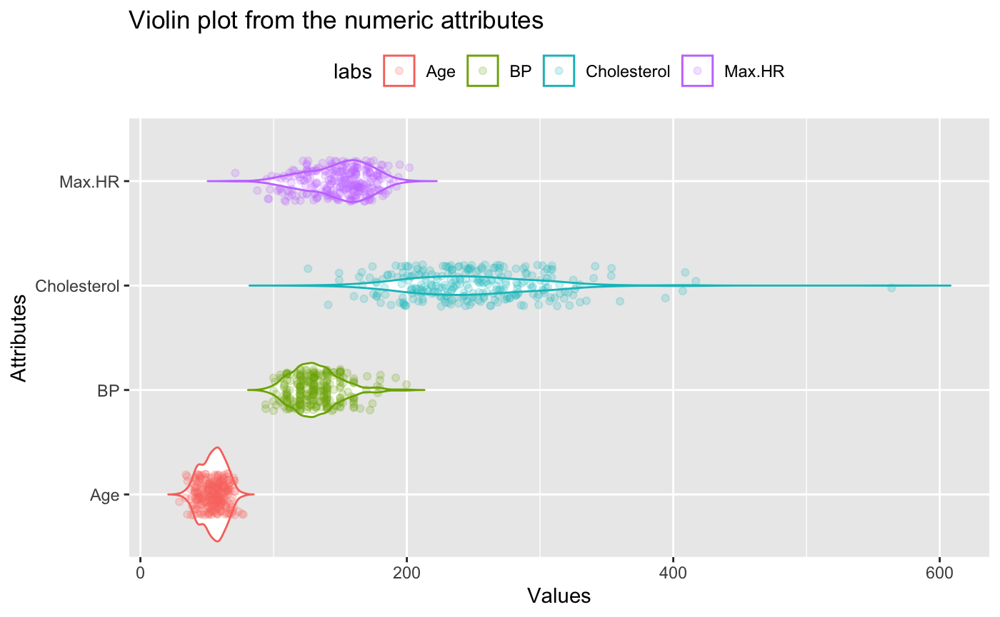
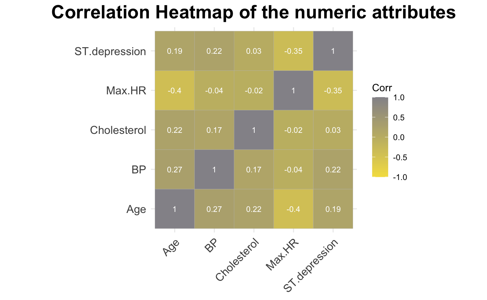

```{r setup, include=FALSE}
knitr::opts_chunk$set(echo = TRUE)
```

# Resultaten

In dit onderdeel zullen de belangrijkste resulaten en bevindingen uit het onderzoek worden getoond. Deze resultaten zullen worden bekrachtig met figuren en/of tabellen.

Allereerst is dit onderzoek begonnen met de exploratieve data analyse (EDA). In dit onderdeel is er gekeken naar verschillende aspecten van de dataset. Neem bijvoorbeeld de samenhang van verschillede attributen of de verdeling van bepaalde variabelen.

Een EDA begint met een aantal algemene eigenschappen van de data. Om te beginnen, de grootte/dimensies van de data. De dataset bevat 15 kolommen en 270 rijen. De dataset bevat dus data van 270 patiënten.

Vervolgens werd er gekeken naar de classificatie variabele. Deze variabele is belangrijk voor het ontwikkelen van het machine learning model. Het model wordt gebaseerd/getraind op deze kolom in je data. De verdeling van dit attribuut wordt onderstaand weergegeven in tabel 1.

| Groepverdeling | Presence (aanwezig) | Absence (afwezig) |
|----------------|---------------------|-------------------|
| Aantal         | 120                 | 150               |

: Tabel 1: Verdeling classificatie variabele

Zoals eerder vermeld bestaat de EDA uit twee onderdelen. Allereerst wordt er gekeken naar univerate analyse.


In figuur 1 zijn 5 grafieken zichtbaar. Van links naar rechts is de verdeling van de leeftijd, bloeddruk, cholesterol gehalte, maximale hartslag en ST depression zichtbaar. De attributen cholesterol en ST depression zijn log10 getransformeerd. Om te beginnen is de leeftijd niet helemaal mooi verdeeld. Dit is ook niet mooi verdeeld met een log10 transformatie. Het neigt een beetje naar rechts te verdelen. De bloeddruk is wel mooi verdeeld. Echter is deze verdeling niet precies in het midden, maar richting de linker zijde van de grafiek. De cholesterol waarde is mooi normaal verdeeld. De maximimale hartslag wijkt iets uit naar rechts, dit geldt ook voor de ST depression. De ST depression waarde loopt heel erg uiteen en is verre van normaal verdeeld.

Bovenstaand worden de verdelingen van de attributen weergegeven. Het is echter ook belangrijk om te kijken hoeveel buitenliggende waardes er zijn in de attributen. Dit staat direct in verband met elkaar, want als er veel buitenliggende waardes zijn, trekken die waardes de verdeling scheef. Onderstaand een violin plot, waarin de verdelingen worden weergegeven samen met de punten uit de data.



Figuur 2 bevat van boven naar beneden, maximale hartslag, cholesterol gehalte, bloeddruk en leeftijd. Van al deze attributen is de verdeling zichtbaar. Daaroverheen zijn de punten van de attributen weergegeven. Op de x-as staan de waarden van de verdeling en op de y-as de attributen. Het is zichtbaar dat cholesterol een behoorlijk aantal punten buiten deze verdeling heeft. Verder heeft de waarde bloeddruk ook een aantal punten buiten de verdeling liggen. Leeftijd bevat de minste punten buiten de verdeling en heeft de minste uitschieters.

Tenslotte, is het nuttig om ook de representatie van de ordinale klassen te tonen. Dit wordt onderstaand gedaan.


Figuur 3 is een barplot zichtbaar van alle ordinale waardes. In deze grafiek zijn van links naar rechts aanwezig: geslacht, pijn op de borst, FBS boven 120, ECG resultaten, Exercise angina, helling ST, aantal aderen, Thallium en hart aandoening. Van elk attribuut is zichtbaar hoe vaak de categoriën voorkomen. Over het algemeen zijn de waardes goed gerepresenteerd. Er zijn wel een paar opvallende zaken. Er zijn behoorlijk meer mannen dan vrouwen. Er zijn weinig tot geen mensen met een FBS van boven de 120.

In het tweede gedeelte van de EDA (biverate analyse) wordt er naar meerdere waarden tegelijk gekeken. Allereerst wordt er gekeken naar de leeftijd tussen de aanwezigheid/afwezigheid groep. In de discussie zal verkrachtigd worden, waarom voor deze vergelijking is gekozen.


In figuur 4 is een boxplot aanwezig. Op de x-as staan de labels aanwezigheid/afwezigheid. Op de y-as staat de leeftijd (in jaren). In deze boxplot is te zien dat de box van de aanwezigheid-groep, hoger ligt dan de de groep met afwezigheid. De minimum, mediaan en maximum liggen hoger. Om te kijken of het verschil ook significant is, wordt er een t-test uitgevoerd.

Uit deze t-toets komt een p-waarde van 0.0001763058. Deze p-waarde is kleiner dan 0.05 en hiermee wordt de nul-hypothese verwerpt, de leeftijd is significant hoger in de aanwezigheid-groep.

Nu er is gekeken naar twee waardes onderling, wordt er ook gekeken naar meerdere waardes. Onderstaand een correlatie heatmap. In deze heatmap is het zichtbaar om de correlatie tussen alle numerieke waardes in de dataset te zien.



Figuur 5 is een heatmap. In deze heatmap staan zowel op de x- als op de y-as alle numerieke attributen. In de blokken van de heatmap is een kleur zichtbaar en een cijfer, deze geven de hoogte van de correlatie weer. De vergelijking tussen maximale hartslag (Max.HR) en ST.depression heeft de laagste correlatie, gevolgd door Max.HR en leeftijd. Tussen leeftijd en bloeddruk is de hoogste correlatie aanwezig.

Aan het eind van de EDA wordt er ook gekeken naar de ordinale waarden. Bovenstaand is er gekeken naar numerieke waarden, maar het is ook mogelijk om met statistische testen een verschil of overeenkomst tussen ordinale attributen aan te tonen. 

Om te beginnen wordt er gekeken naar het (biologische) geslacht van de patienten in de dataset. Dit attribuut is nog niet aan bod gekomen. Er wordt gekeken of er een verschil is tussen geslacht en aandoening. D.w.z, is er een verschil in geslacht tussen de aanwezigheid/afwezigheid van een hartaandoening.

Om deze vergelijking te maken wordt er een Chi-kwadraat toets uitgevoerd. Deze test is geschikt om nominale waardes met elkaar te vergelijken.

De nulhypothese van een Chi-kwadraat toets is dat er geen relatie aanwezig is tussen de attributen, de waardes zijn onafhankelijk. Uit de toets komt een p-waarde van 9.979e-07. Deze waarde is kleiner dan 0.05. Hiermee wordt de nulhypothese verwerpt. Er is een hoge overeenkomstigheid.

# Discussie en Conclusie

## Discussie

-   Compare your results with what is expecting from the literature and discuss differences with them.
-   Discuss striking and surprising results.
-   Discuss weaknesses in your research and how they could be addressed.

## Algemene conclusie en perspectief

Discuss what your goal was, what the end result is and how you could continue working from here.
