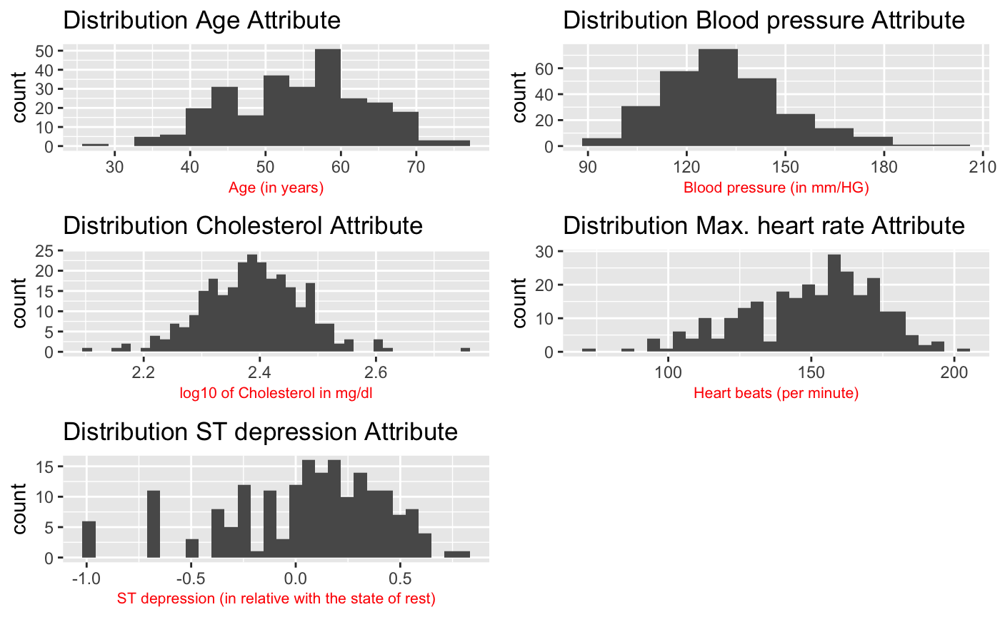
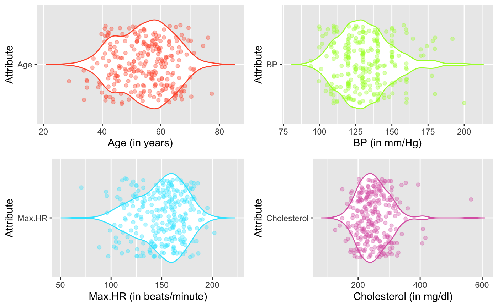
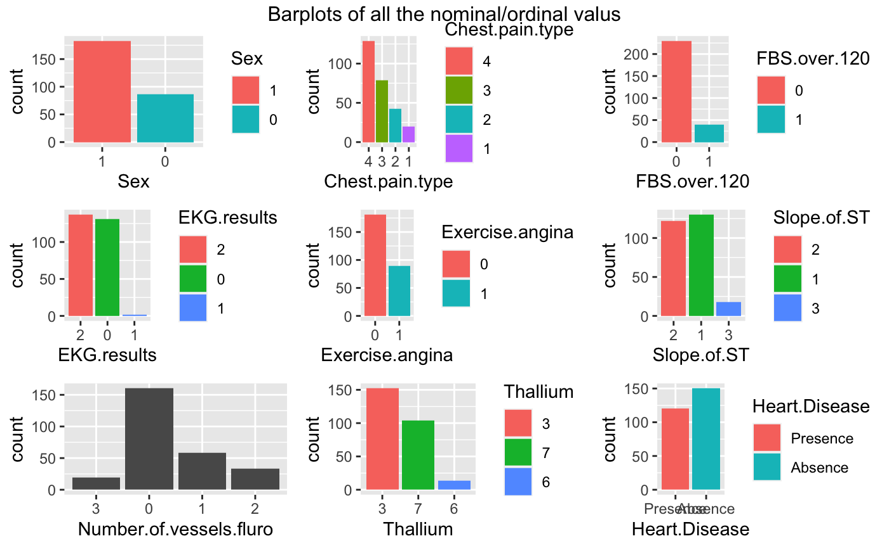

```{r setup, include=FALSE}
knitr::opts_chunk$set(echo = TRUE)
```

# Resultaten

In dit onderdeel zullen de belangrijkste resulaten en bevindingen uit het onderzoek worden getoond. Deze resultaten zullen worden bekrachtig met figuren en/of tabellen.

Allereerst is dit onderzoek begonnen met de exploratieve data analyse (EDA). In dit onderdeel is er gekeken naar verschillende aspecten van de dataset. Neem bijvoorbeeld de samenhang van verschillede attributen of de verdeling van bepaalde variabelen.

Een EDA begint met een aantal algemene eigenschappen van de data. Om te beginnen, de grootte/dimensies van de data. De dataset bevat 15 kolommen en 270 rijen. De dataset bevat dus data van 270 patiënten.

Vervolgens werd er gekeken naar de classificatie variabele. Deze variabele is belangrijk voor het ontwikkelen van het machine learning model. Het model wordt gebaseerd/getraind op deze kolom in je data. De verdeling van dit attribuut wordt onderstaand weergegeven in tabel 1.

| Groepverdeling | Presence (aanwezig) | Absence (afwezig) |
|----------------|---------------------|-------------------|
| Aantal         | 120                 | 150               |

: Tabel 1: Verdeling classificatie variabele

Zoals eerder vermeld bestaat de EDA uit twee onderdelen. Allereerst wordt er gekeken naar univerate analyse.



In figuur 1 zijn 5 grafieken zichtbaar. Van links naar rechts is de verdeling van de leeftijd, bloeddruk, cholesterol gehalte, maximale hartslag en ST depression zichtbaar. De attributen cholesterol en ST depression zijn log10 getransformeerd. Om te beginnen is de leeftijd niet helemaal mooi verdeeld. Dit is ook niet mooi verdeeld met een log10 transformatie. Het neigt een beetje naar rechts te verdelen. De bloeddruk is wel mooi verdeeld. Echter is deze verdeling niet precies in het midden, maar richting de linker zijde van de grafiek. De cholesterol waarde is mooi normaal verdeeld. De maximimale hartslag wijkt iets uit naar rechts, dit geldt ook voor de ST depression. De ST depression waarde loopt heel erg uiteen en is verre van normaal verdeeld.

Bovenstaand worden de verdelingen van de attributen weergegeven. Het is echter ook belangrijk om te kijken hoeveel buitenliggende waardes er zijn in de attributen. Dit staat direct in verband met elkaar, want als er veel buitenliggende waardes zijn, trekken die waardes de verdeling scheef. Onderstaand een violin plot, waarin de verdelingen worden weergegeven samen met de punten uit de data.



Figuur 2 bevat van links naar rechts, leeftijd, bloeddruk, maximale hartslag en cholesterol. Van al deze attributen is de verdeling zichtbaar. Daaroverheen zijn de punten van de attributen weergegeven. Op de x-as staan de waarden van de verdeling en op de y-as het attribuut. De waarde bloeddruk heeft het meeste aantal punten buiten de verdeling liggen. Cholesterol bevat de minste punten buiten de verdeling en heeft de minste uitschieters.

Tenslotte, is het nuttig om ook de representatie van de ordinale klassen te tonen. Dit wordt onderstaand gedaan.



Figuur 3 is een barplot zichtbaar van alle ordinale waardes. In deze grafiek zijn van links naar rechts aanwezig: geslacht, pijn op de borst, FBS boven 120, ECG resultaten, Exercise angina, helling ST, aantal aderen, Thallium en hart aandoening. Van elk attribuut is zichtbaar hoe vaak de categoriën voorkomen. Over het algemeen zijn de waardes goed gerepresenteerd. Er zijn wel een paar opvallende zaken. Er zijn behoorlijk meer mannen dan vrouwen. Er zijn weinig tot geen mensen met een FBS van boven de 120.

In het tweede gedeelte van de EDA (biverate analyse) wordt er naar meerdere waarden tegelijk gekeken. Allereerst wordt er gekeken naar de correlaties tussen de numerieke waardes. Deze correlaties worden weergegeven in een heatmap.


In deze heatmap (figuur 5) staan zowel op de x- als op de y-as alle numerieke attributen. In de blokken van de heatmap is een kleur zichtbaar en een cijfer, deze geven de hoogte van de correlatie weer. De vergelijking tussen maximale hartslag (Max.HR) en ST.depression heeft de laagste correlatie, gevolgd door Max.HR en leeftijd. Tussen leeftijd en bloeddruk is de hoogste correlatie aanwezig.

Tot slot wordt er nog gekeken naar p-waardes van statistische toetsen Elk attribuut is getoetst tegen de ziek/niet ziek groep. Op deze manier kan er worden aangetoond welke waardes een samenhang met elkaar hebben.

| Attribuut         | P-waarde  |
|-------------------|-----------|
| Thallium          | 6.419e-17 |
| Chest Pain Type   | 8.561e-15 |
| Number of vessles | 1.437-13  |
| Max HR            | 2.604e-12 |
| Exercise Angina   | 5.585e-12 |
| ST depression     | 1.601e-11 |
| Slope of ST       | 1.713e-09 |
| Sex               | 9.979e-07 |
| Age               | 0.0003526 |
| EKG results       | 0.01122   |
| BP                | 0.01196   |
| Cholesterol       | 0.04971   |
| FBS over 120      | 0.7886    |

: Tabel 2: De p-waardes van de statistische toetsen

In de bovenstaande tabel zijn de p-waardes zichtbaar. Bij een p-waarde lager dan 0.05 is er een significant verschil. Het attribuut Thallium heeft de laagste p-waarde en dus ook de meeste samenhang met de classificatie kolom. Verder zeggen de waardes Cholesterol en FBS over 120 weinig, want deze hebben een p-waarde van rond de 0.05 of groter dan 0.05.

Voordat er een machine learning model ontwikkeld kan worden, moeten er nog aantal ascpecten van de data worden aangepast. Om te beginnen is de eerste kolom verwijderd. Verder worden een aantal attributen omgezet in een label, dit om de dataset overzichterlijker en leesbaarder te maken. Tot slot worden de cholesterol en ST.depression atributen getransformeerd (log10). Dit wordt gedaan, omdat de log10 verdeling van deze waardes een *betere* verderling toonde.

# Discussie en Conclusie

## Discussie

In deze sectie zal er teruggekomen worden de resultaten en een antwoord worden gegeven op de onderzoeksvraag.

Allereerst de resultaten van de EDA. In deze sectie is er gekeken naar de eigenschappen van de data. Maar ook de samenhang tussen vele attributen. Om te beginnen zijn de buitenliggende waardes weergegeven. Dit werd gedaan door middel van een violin plot. In dit plot zijn naar verhouding, weinig buitenliggende waardes te zien. Er zijn welliswaar een aantal waardes die buiten de verdeling liggen, maar dit is niet significant. 

De numerieke waardes bevatten geen lege waardes en zijn redelijk normaal verdeeld. Samen met het feit dat deze waarden weinig tot geen buitenliggende waardes bevat, hoeven de attributen niet worden aangepast of gemodificeerd. 

Verder is er ook gekeken naar de samenhang van waardes. Dit werd onder andere gedaan in een correlatie heatmap. In dit figuur zijn weinig uitschieters of opvallende waardes zichtbaar. Alle waardes compenseren mooi met elkaar.

Tot slot werd er in de EDA gekeken naar de p-waardes van statistiche toetsen. Alle attributen in de dataset zijn getest met de ziek/niet ziek groep om de samenhang te bepalen. 11 van de 13 kolommen bevat een p-waarde lager dan 0.05. Dit betekend dat er 11 attributen zijn die een signiciante samenhang hebben met de ziek/niet ziet waarde. Al deze attributen zijn dus geschikt om een model op te bouwen. 

## Conclusie

Voordat er begonnen wordt aan het bouwen van een model is het belangrijk om de data te inspecteren. De dataset bevatte weinig opmerkelijk resultaten. 

Allereerst waren er geen missende waardes aanwezig, twee attributen zijn getransformeerd om de beste verdeling te hebben, er waren niet veel uitschieters aanwezig en meer dan dan 80% van de attributen had een grote samenhang met de classificatie kolom. 

Deze resultaten samen met de omzetting van een aantal labels in overzichtelijke waardes, maakt deze schone data geschikt voor het ontwikkelen van een machine learning model.

Echter had de dataset natuurlijk beter gekund. Om te beginnen, zijn 270 patiënten weinig. Zeker omdat de data afkomstig is van 4 verschillende bronnen. Verder hadden er nog attributen kunnen worden toegevoegd. Denk bijvoorbeeld aan de lichaamslengte van de patiënt. Hiermee kan de BMI ook bepaald worden. 


